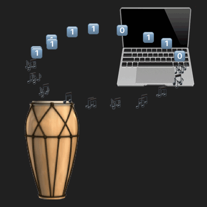

Drums have been used as a [communication tool](https://en.wikipedia.org/wiki/Drums_in_communication) (distance/ceremony/etc) for eons. Why not use them to communicate with your own personal technological device?! Introducing...

# Bongotype!

Bongotype is the world's ~~first~~ [second](https://www.reddit.com/r/badUIbattles/comments/gha25t/ascii_input_keyboard_the_binary_bongos/) bongo-based human computer interface! Much like a stenographer's chorded [stenotype keyboard](https://en.wikipedia.org/wiki/Stenotype) enables realtime transcription, this unchorded [bongoboard](https://en.wikipedia.org/wiki/GameCube_accessories#DK_Bongos) facilitates computer input at up to X BPM (bongos per minute)---not to mention a yell modifier! 

Special input modes designed for special use-cases may include:
- `morse code` mode: drum your message madly!
- `binary` mode: drum your bytes madly!
- `git` mode: you drummed your changes, now drum your commit!
- `mouse` mode: yell to control the mouse! Change volume to move up/down the screen, and change pitch to move left to right!
- `movement` mode: while yelling, specific drum patterns correspond to arrow and tab keys!

### Dev notes

Under active ideation, as part of a creative coding exercise at the [Recurse Center](https://www.recurse.com/)! Language itself not yet created (where "yet" is the operative word). Stay tuned! :D

[Logo](https://editor.p5js.org/hannahilea/sketches/77GaUZb62) created in p5.js; adapted from preexisting [earth/moon/orbit sketch](https://happycoding.io/tutorials/p5js/arrays/earth-moon-emoji-orbit).
